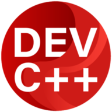
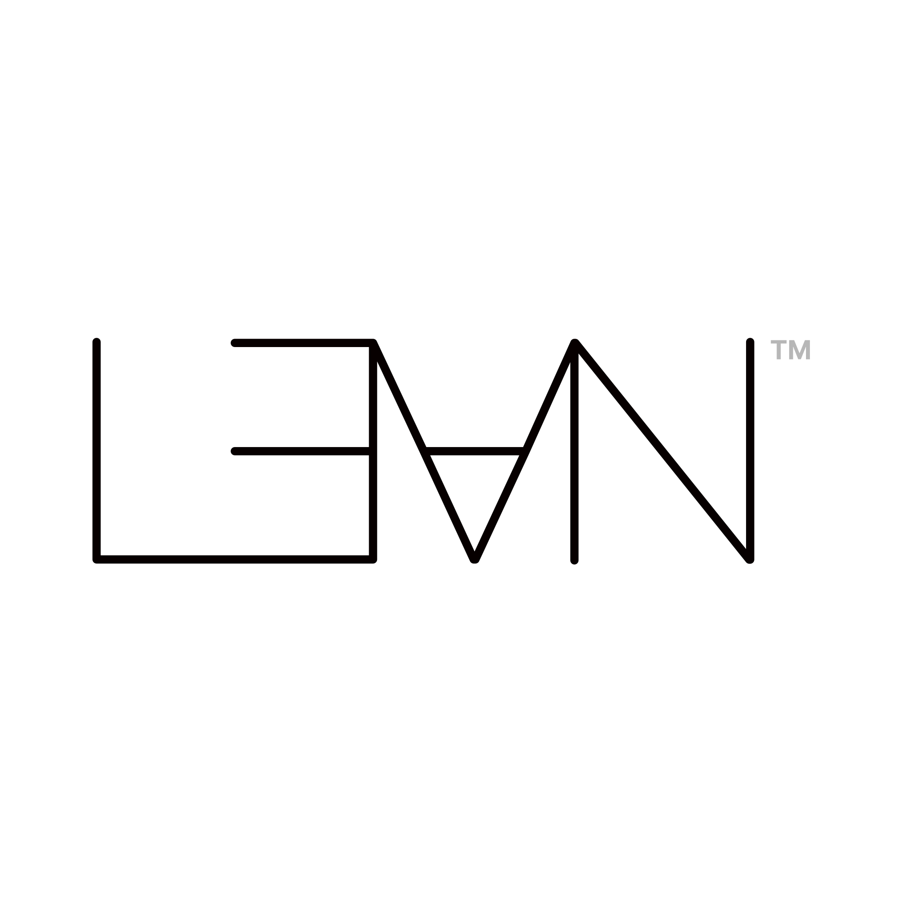

<h1 align="center">doralyyyyy</h1>

  Developer building polished interfaces, practical systems, and AI-assisted tools.

  <a href="mailto:2400011765@stu.pku.edu.cn">2400011765@stu.pku.edu.cn</a>

---

## Stack

### Frontend
<table align="center">
  <tr>
    <td align="center" width="96">
       HTML
    </td>
    <td align="center" width="96">
       CSS
    </td>
    <td align="center" width="96">
       JavaScript
    </td>
    <td align="center" width="96">
       TypeScript
    </td>
    <td align="center" width="96">
       React
    </td>
    <td align="center" width="96">
       Vite
    </td>
    <td align="center" width="96">
       Tailwind CSS
    </td>
  </tr>
</table>

### Backend / SQL
<table align="center">
  <tr>
    <td align="center" width="96">
       Python
    </td>
    <td align="center" width="96">
       C
    </td>
    <td align="center" width="96">
       C++
    </td>
    <td align="center" width="96">
       Rust
    </td>
    <td align="center" width="96">
       Java
    </td>
    <td align="center" width="96">
       Go
    </td>
    <td align="center" width="96">
       Node.js
    </td>
    <td align="center" width="96">
       SQL
    </td>
  </tr>
</table>

### Creative Tools
<table align="center">
  <tr>
    <td align="center" width="96">
       Photoshop
    </td>
    <td align="center" width="96">
       Premiere Pro
    </td>
    <td align="center" width="96">
       Audition
    </td>
    <td align="center" width="96">
       After Effects
    </td>
    <td align="center" width="96">
       Cubase
    </td>
  </tr>
</table>

### IDE
<table align="center">
  <tr>
    <td align="center" width="96">
       VS Code
    </td>
    <td align="center" width="96">
       Visual Studio
    </td>
    <td align="center" width="96">
       Cursor
    </td>
    <td align="center" width="96">
       Dev-C++
    </td>
    <td align="center" width="96">
       Trae
    </td>
    <td align="center" width="96">
       PyCharm
    </td>
    <td align="center" width="96">
       Jupyter Notebook
    </td>
  </tr>
</table>

### OS
<table align="center">
  <tr>
    <td align="center" width="96">
       Windows
    </td>
    <td align="center" width="96">
       Linux
    </td>
  </tr>
</table>

### Other
<table align="center">
  <tr>
    <td align="center" width="96">
       Markdown
    </td>
    <td align="center" width="96">
       LaTeX
    </td>
    <td align="center" width="96">
       Lean
    </td>
  </tr>
</table>

### Languages
<table align="center">
  <tr>
    <td align="center" width="96">
       Chinese
    </td>
    <td align="center" width="96">
       Japanese
    </td>
    <td align="center" width="96">
       English
    </td>
  </tr>
</table>

## Selected Work

| Project | Focus | Stack |
| --- | --- | --- |
| [MolPropLab](https://github.com/doralyyyyy/MolPropLab) | SMILES-based molecular property prediction with batch inference, uncertainty estimates, and 3D visualization. | React, Vite, Tailwind, Node.js, Python, RDKit |
| [RustNetLens](https://github.com/doralyyyyy/RustNetLens) | Local HTTP proxy and traffic inspector with capture, persistence, filtering, export, rewrite, and replay. | Rust, Tauri 2, React, TypeScript |
| [Desktop-Mascot](https://github.com/doralyyyyy/Desktop-Mascot) | Windows desktop mascot prototype with chat, screen capture, AI TTS, and Live2D/Tk fallback. | Python, Electron, Tk |
| [QChat](https://github.com/doralyyyyy/QChat) | Qt-based chat app with client/server split, voice features, and network setup support. | C++, Qt, Python |
| [OrganicChem-AI](https://github.com/doralyyyyy/OrganicChem-AI) | AI-assisted organic chemistry app with PKU network and local deployment support. | JavaScript, Node.js, Vite, Tailwind |

## GitHub Signal

  
  

  
  

  
  

